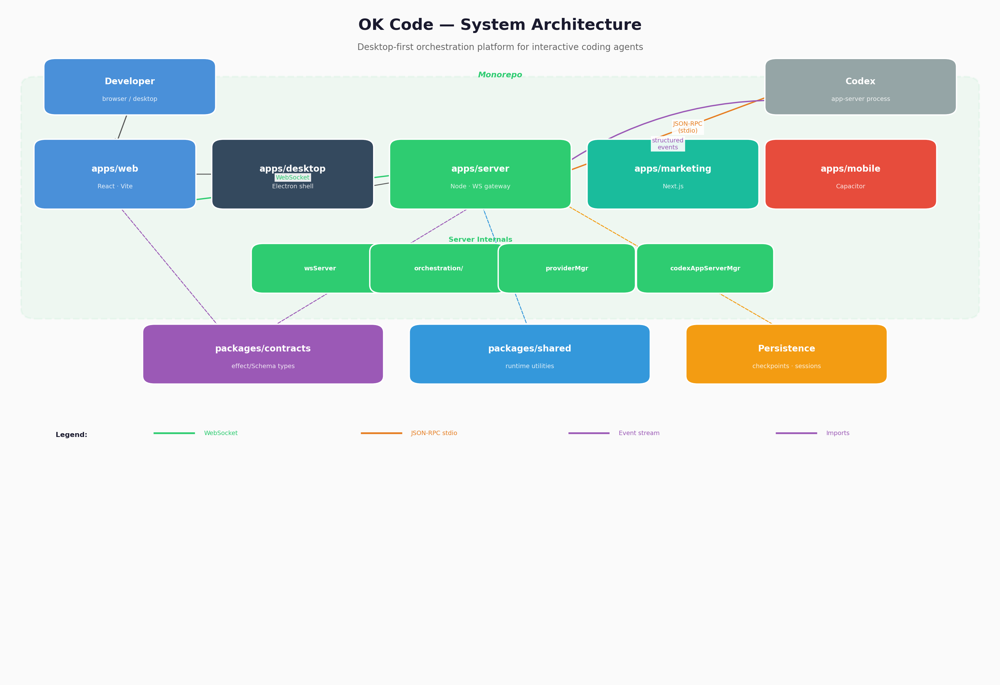
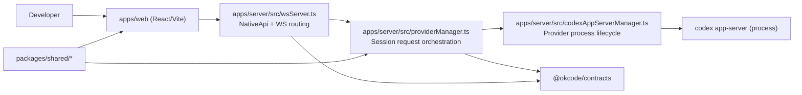
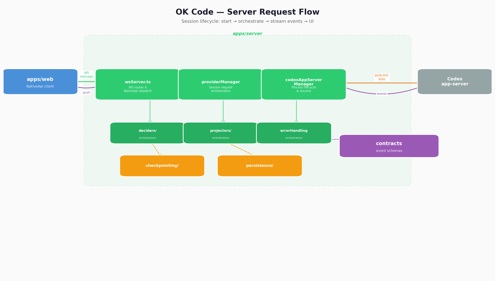
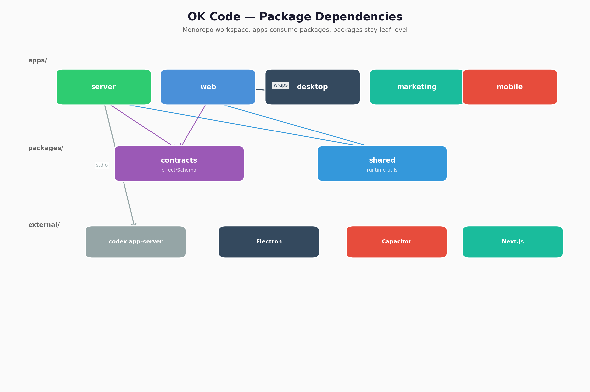
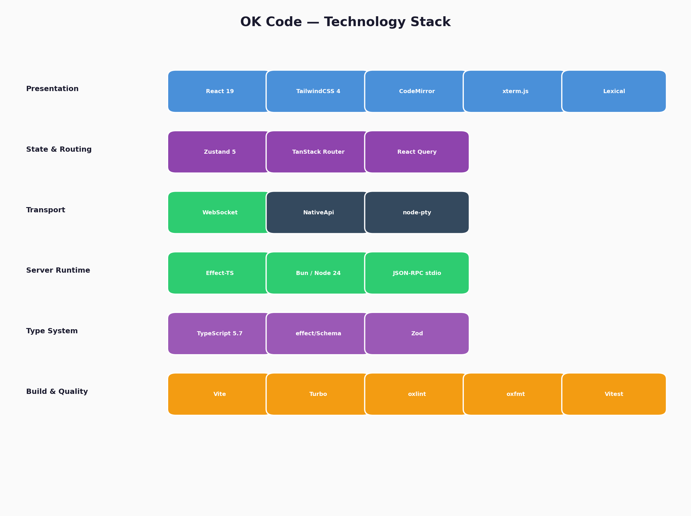
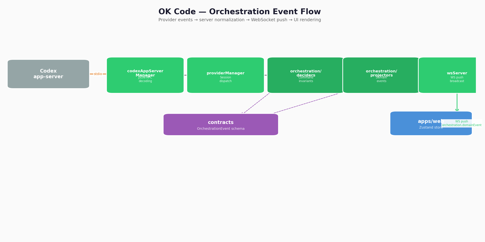

# OK Code

## 1) What this project is

OK Code is a desktop-first orchestration platform for interactive coding agents.
It connects a local runtime (`apps/server`) that manages provider sessions with a
React client (`apps/web`) that renders live orchestration events and session state.

## 2) Architecture and core flow

### High-level flow



<details>
<summary>Mermaid source (text fallback)</summary>



</details>

### Server request flow



### Package dependencies



### Component responsibilities

- `apps/server`
  - Owns session lifecycle: start/resume, reconnect handling, provider multiplexing.
  - Provides the WebSocket API that the web app talks to.
  - Converts provider output into shared orchestration-domain events.
- `apps/web`
  - Owns user interaction, streaming UI, logs, and local state.
  - Consumes server events and sends control actions back through `NativeApi`.
- `packages/contracts`
  - Shared protocol/event types (`effect/Schema`) used by both sides.
  - Keep this package schema-focused and stable.
- `packages/shared`
  - Cross-package runtime helpers with explicit subpath exports (for example `@okcode/shared/git`).
  - Use shared helpers instead of duplicating transport/session utility code.

## 3) Repository map

```text
apps/
  server/      Runtime orchestration and websocket gateway.
  web/         React conversation and orchestration UI.
  desktop/     Electron shell and client bootstrap.
  marketing/   Marketing/public site.
  mobile/      Capacitor app wrapper/build tooling.
packages/
  contracts/   Shared protocol/schema definitions.
  shared/      Shared runtime utilities.
docs/
  releases/    Release process, release notes, and asset manifests.
  mobile-mvp.md Phased mobile app release plan and checklist.
scripts/
  Build/release/bootstrap scripts and local tooling.
```

Mobile plan: [docs/mobile-mvp.md](/Users/buns/.okcode/worktrees/okcode/okcode-04310139/docs/mobile-mvp.md)

## 4) Setup and local development

### Required tooling

- Bun (matching project engine): `bun@1.3.11+`
- Node 24+ (repo declares `bun` + `node` engine compatibility)
- Xcode for iOS-related work
- macOS or Linux for development

### Install

```bash
bun install
```

### Run everything

```bash
bun dev
```

### Common workflows

```bash
bun dev:server         # apps/server only
bun dev:web            # apps/web only
bun dev:desktop        # desktop shell + electron dev flow
bun dev:marketing      # marketing site
```

Build marketing directly:

```bash
bun install
bun run build:marketing
```

If `bun run build:marketing` fails with `next: command not found`, run `bun install` first to restore workspace dependencies.

### Package scoped examples

```bash
bun --filter @okcode/web dev
bun --filter okcodes dev
bun --filter @okcode/desktop build
bun --filter @okcode/contracts typecheck
```

> `bun --filter okcodes dev` is useful when you explicitly want the server package by
> its legacy package name (`okcodes`).

### Quick-start operator matrix

| Intent                    | Command                          | Expected result                                  | Where to verify                                        |
| ------------------------- | -------------------------------- | ------------------------------------------------ | ------------------------------------------------------ |
| Boot full local stack     | `bun dev`                        | workspace starts dev scripts and shared services | logs show dev server/process startup                   |
| Run desktop app flow only | `bun dev:desktop`                | local Electron + web bundle pipeline starts      | verify desktop window opens and server socket connects |
| Build desktop artifacts   | `bun build:desktop`              | production desktop build output generated        | workspace build pipeline succeeds in logs              |
| Build web app             | `bun --filter @okcode/web build` | Vite build output produced                       | check dist artifacts and exit code 0                   |
| Validate formatting       | `bun run fmt:check`              | no formatting diffs                              | command exits 0                                        |
| Validate lint rules       | `bun run lint`                   | lint passes                                      | no lints in output                                     |
| Validate TypeScript       | `bun run typecheck`              | no compile errors                                | all package typechecks pass                            |
| Run tests                 | `bun run test`                   | Vitest suites execute                            | exit code 0, no failing tests                          |

### Technology stack



## 5) Runtime behavior (what happens during a session)



1. Web UI opens WebSocket and subscribes to orchestration events.
2. UI submits user action to a `NativeApi` endpoint in `wsServer.ts`.
3. Server dispatches the request through `providerManager`.
4. `codexAppServerManager` starts or resumes the underlying `codex app-server` process.
5. Process outputs are parsed, normalized into shared events, and pushed back to UI.
6. UI applies deterministic reducers for rendering logs, state, and action controls.

Reconnect and recovery are first-class behaviors:

- active process restarts should resume context when session state is available,
- failed parses are surfaced as explicit error states instead of silent fallback behavior.

## 6) Contracts and compatibility

- All contract changes should begin in `packages/contracts`.
- Update both producer (`apps/server`) and consumer (`apps/web`) in the same commit.
- Validate generated type surface with:
  - `bun run typecheck`
  - targeted package `typecheck` scripts when needed.

## 7) Build and quality gates

```bash
bun run fmt
bun run fmt:check
bun run lint
bun run typecheck
bun run test
```

Notes:

- `bun run test` is the required test entrypoint.
- Formatting uses `oxfmt`; lint uses `oxlint`.
- Release tasks in CI are intentionally strict and require clean checks to proceed.

## 8) Release operations

Release is mostly driven by `.github/workflows/release.yml` and docs in `docs/releases`.

- Trigger on tag push (`vX.Y.Z`) or `workflow_dispatch`.
- Preflight does `bun run lint`, `bun run typecheck`, `bun run test`,
  and release smoke.
- Artifact build step executes `bun run dist:desktop:artifact`.
- Publishing requires release notes + asset manifest for the version.

For a practical walkthrough, use the release playbook in
[`docs/releases/README.md`](/Users/buns/.okcode/worktrees/okcode/okcode-ddc899c0/docs/releases/README.md).

## 9) Extending the system (recommended pattern)

1. Start at the boundary where behavior changes:
   - event shape → `packages/contracts`
   - runtime orchestration → `apps/server`
   - rendering/state handling → `apps/web`
2. Add/update shared types first.
3. Update server-side translation/projection next.
4. Update UI consumers and add tests or focused regression checks.
5. Run all quality gates before commit.

## 10) Security and operational posture

- No secrets in files tracked by git.
- Validate untrusted inputs before invoking spawn/process APIs.
- Keep cleanup idempotent (process kill, temp files, sockets).
- Emit explicit telemetry for failure modes to avoid hidden partial failures.

## 11) FAQ

- **Why are x64 macOS artifacts sometimes absent from release matrix?**  
  The release workflow can be configured to build only Apple Silicon by default for `workflow_dispatch` with `mac_arm64_only=true`.
- **Why strict release gates?**  
  They prevent format/type drift from reaching published artifacts.
- **Can I run release checks locally first?**  
  Yes, run the section 7 checks and create your release notes manifest files before creating a tag.

## 12) Operational checklists

### Pre-PR gate

1. `bun run fmt:check`
2. `bun run lint`
3. `bun run typecheck`
4. `bun run test`
5. targeted package checks if changing app/domain boundaries

### Pre-release hardening

1. Ensure release notes and asset manifest are prepared.
2. Confirm release matrix intent (`mac_arm64_only` expectation).
3. Confirm signing secrets availability for macOS/Windows targets.
4. Confirm `docs/releases/v<version>.md` and `docs/releases/v<version>/assets.md` exist.
5. Trigger release and monitor all jobs.

## 12) Contributing expectations

- Favor small scoped changes with clear ownership.
- Keep protocol surfaces version-consistent and documented.
- Update docs whenever startup flow, payload contracts, or release behavior changes.
- Prefer correctness over convenience in stream/retry code.
